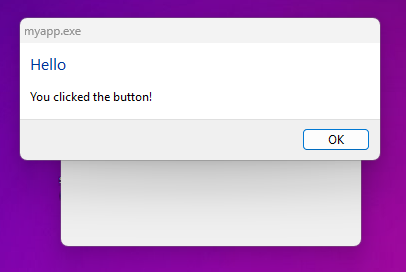

# libui Example Application

This is a simple example project demonstrating usage of libui-ng with a basic GUI on Windows.

### clone recursively!

```
git clone --recursive https://github.com/KoleckOLP/libui_window.git
```

## Screenshots

### Windows 11

<p float="left">
  
  
  
</p>

### Windows 10

<p float="left">
  
  
  
</p>

### macOS

<p float="left">
  
  
  
</p>

### Linux KDE

<p float="left">
  
  
  
</p>

## Requirements

### Windows

- make
- gcc or clang (MSYS / MingGW)
- g++ or clang++ (MSYS / MingGW)
- windres, meson, ninja
- libui-ng clone with the repo, built with make.
- Standard Windows libraries (comctl32, ole32, uuid, d2d1, dwrite, dgi32) they come with Windows.

To build and run: (Windows Executable)

`make run`

### macOS

- make
- gcc or clang (symlinked to gcc)
- g++ or clang++ (symlinked to g++)
- meson, ninja
- libui-ng clone with the repo, built with make.
- Standard macOS libraries (CoreText, CoreGraphics, Foundation, AppKit) tehy come with macOS

To build and run: (macOS AppBundle)

`make runapp`

### Linux

- make
- gcc or clang (symlinked to gcc)
- g++ or clang++ (symlinked to g++)
- meson, ninja
- libui-ng clone with the repo, built with make.
- gtk3-devel, pkg-config

To build and run: (Linux ELF executable)

`make run`

## Building

Run make to build the executable myapp.exe.

`make`

This builds libui-ng, controls.c main.c as well as Windows resource file and links them all together with Windows libraries. Production build by default.

## other make commands

Builds the debug build and runs it, this one has Console output.

`make clean debug run`

Builds the prod build and runs it, optimized and not Console ouput.

`make clean prod run`

changing between proc and debug needs a `make clean`.

Builds the macOS AppBundle

`make runapp`

## Cleaning

Remove build artifacts with:

`make clean`

## TODO

- make a list of MSYS packages for Windows build
- Try on weird platforms like BSD or Haiku, but libui-ng probably doesn't support those.
